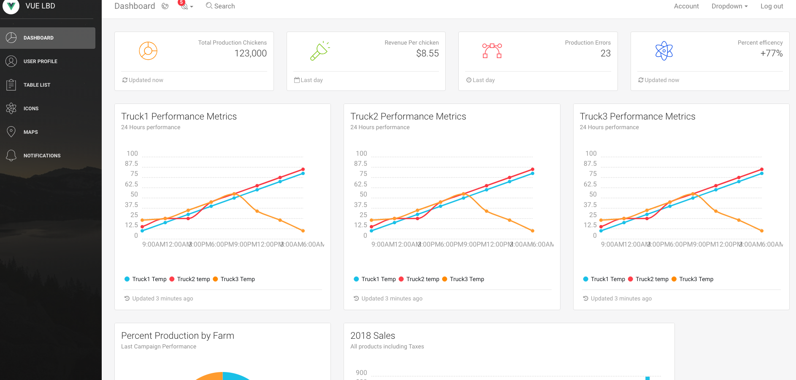

# Assets-IO_A5 IoT Streaming Supply Chain


Establish a secure, trustworthy, connected system that provides actionable insight from farm to fork for food in the Consumer Packaged Goods industry.

Main Priorities:

* Tracking goods and verifying product source
* Identify food safety concerns and recalls
* Integrating upstream and downstream processes and reduce human error
* Develop real-time actionable insight



## Getting Started

These instructions will get you a copy of the project up and running on your local machine for development and testing purposes. See deployment for notes on how to deploy the project on a live system.

The blockchain side of the application will not record data unless a blockchain instance has been provisioned and connected with the appropriate chaincode.


## Pages

**Dashboard** - shows the various parameters of the assets that are being trasacted as well as a list of these assets. These parameters include: Asset ID, Type, Price, Period, price change, current status

**Action list** - Blank page for custom actions

**Submit page** - Asset submission test page used to submit assets into the blockchain for testing

**Notifications** - This is a custom dashboard that shows all the overal statuses of the components of the application

	- Overall Network status - Overall check of any of the components and if any of them don't work, this will be red
	- Blockchain status - Check if the blockchain is up and running
	- Blockchain version - Shows current version of the chaincode
	- OIC connector - Check if the connector is running
	- Single View - Check if the single view application is responding
	- Siebel status - Current status of Siebel software


### Prerequisities
------
- Node JS
- Angular CLI
- NPM

Installing without Brew

```
curl "https://nodejs.org/dist/latest/node-${VERSION:-$(wget -qO- https://nodejs.org/dist/latest/ | sed -nE 's|.*>node-(.*)\.pkg</a>.*|\1|p')}.pkg" > "$HOME/Downloads/node-latest.pkg" && sudo installer -store -pkg "$HOME/Downloads/node-latest.pkg" -target "/"
npm install -g @angular/cli
```


With homebrew

```
brew install node
brew install angular-cli
```

### Installing
------
The application is a multipart application which has three parts. 

Front end - Interfaces with the middleware inorder to show all the data 

Middleware - interfaces with the blockchain and holds all the api interfaces

Blockchain - records all the data for immutiblity 

## Deployment and Using the App


#### Creating blockchain instance

This guide is made with the assumtion that a blockchain instance has already been created. In order to create a blockchain, if one is not available please follow the creating a blockchain instance guide.

#### Checking the blockchain for runtime

1. Access block chain from www.cloud.oracle.com
2. Click on signin on the top bar
3. Sign into the tenancy 
4. Sign in with your SSO in order to access the environement
5. Double check your instance is running in the list
6. In order to check any details of the instance click on the hamburger menu to the left of the instance


#### Starting the Middleware

```
cd UI/Middleware
npm install
npm start

```


#### Starting the Frontend

```
cd UI/Frontend
npm install
npm start
open http://localhost:4200

```


## Running tests

No test need to be ran at this time


## Built With

* Angular 7
* Node.js
* oracle blockchain

##Unsolved problems, etc.

* CORs issue is currently underdevelopment, and in order to use the front end cors plugin needs to be used in chrome - this is a front end archture issue
* could use a beutified layout
* styling

## Contributing

Please read [CONTRIBUTING.md](CONTRIBUTING.md) for details on our code of conduct, and the process for submitting pull requests to us.

## Versioning

1.0.0

## Authors

**Ilya Osovets** -- [ilya0](https://github.com/ilya0)


See also the list of [contributors](https://github.com/your/project/contributors) who participated in this project.

## License

This project is licensed under the MIT License - see the [LICENSE.md](LICENSE.md) file for details

## Acknowledgments

* App Dev Oracle Hub
